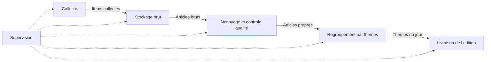

# Architecture cible — La gazette

Statut : schema de principe a completer.
Les outils, les formats echanges et les lieux d'execution restent a preciser.

```mermaid
flowchart LR
    A[Collecte] -->|Items collectes| B[Stockage brut]
    B -->|Articles bruts| C[Nettoyage et controle qualite]
    C -->|Articles propres| D[Regroupement par themes]
    D -->|Themes du jour| E[Livraison de l edition]

    S[Supervision] -.-> A
    S -.-> B
    S -.-> C
    S -.-> D
    S -.-> E
```
